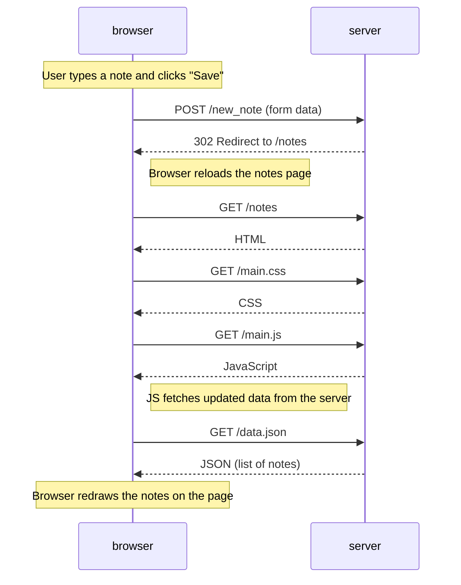

```mermaid
sequenceDiagram
  participant browser
  participant server

Note over browser: User types a note and clicks "Save"
browser->>server: POST /new_note (form data)
server-->>browser: 302 Redirect to /notes

Note right of browser: Browser reloads the notes page
browser->>server: GET /notes
server-->>browser: HTML

browser->>server: GET /main.css
server-->>browser: CSS

browser->>server: GET /main.js
server-->>browser: JavaScript

Note right of browser: JS fetches updated data from the server
browser->>server: GET /data.json
server-->>browser: JSON (list of notes)

Note over browser: Browser redraws the notes on the page
```
