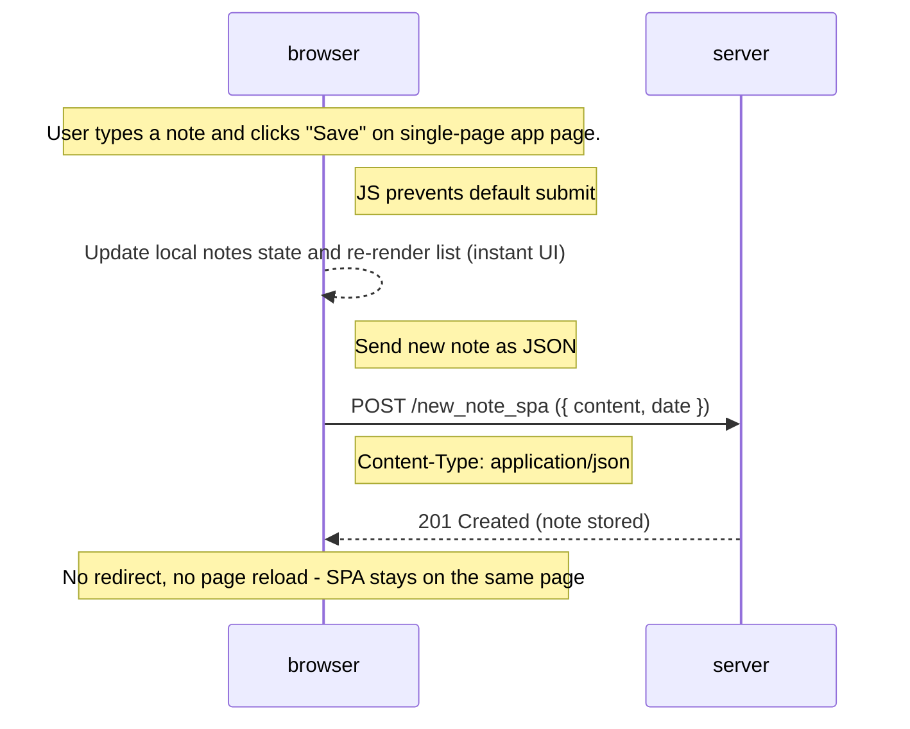

```mermaid
sequenceDiagram
  participant browser
  participant server

Note over browser: User types a note and clicks "Save" on single-page app page.
Note right of browser: JS prevents default submit
browser-->>browser: Update local notes state and re-render list (instant UI)

Note right of browser: Send new note as JSON
browser->>server: POST /new_note_spa ({ content, date })
Note right of browser: Content-Type: application/json
server-->>browser: 201 Created (note stored)

Note over browser: No redirect, no page reload - SPA stays on the same page
```
